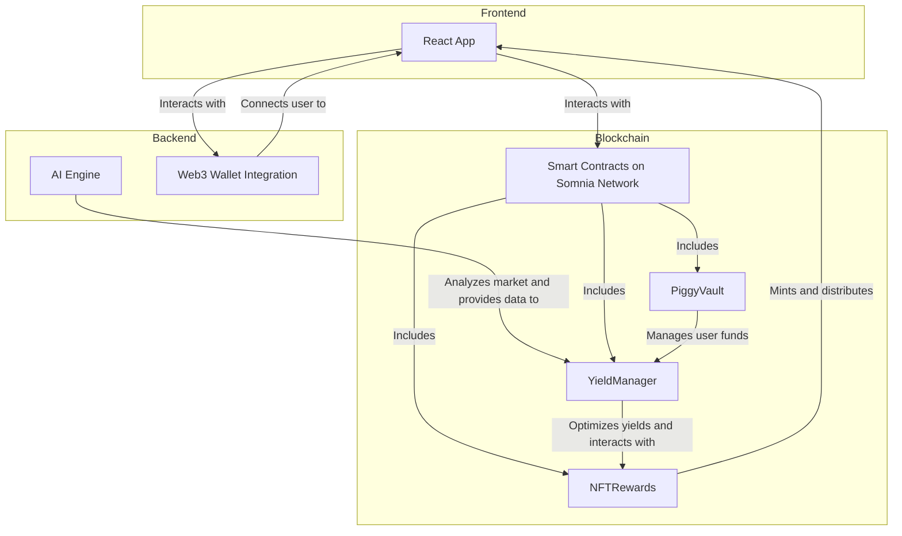

# Piggy Boss - AI-Powered DeFi Savings Platform

## What is Piggy Boss?

**Piggy Boss** is an innovative, AI-powered decentralized finance (DeFi) savings platform built on the Somnia Network. Our mission is to empower users by automating crypto yield optimization while rewarding them with exclusive Non-Fungible Tokens (NFTs). Piggy Boss acts as your intelligent financial assistant, working tirelessly around the clock to maximize your investment returns.

## The Problem We Solve

The world of DeFi, while offering immense opportunities, presents significant challenges for many users:

- **Complexity of Manual Management**: Users often struggle with the need to constantly monitor and manually switch between various DeFi protocols to find the best yields.
- **Missed Opportunities**: The most profitable yield opportunities can change in an instant, making it nearly impossible for individuals to track and capitalize on them all.
- **Lack of Engagement**: Traditional savings methods can be mundane and lack the engaging, gamified experiences that modern users expect.
- **Time-Consuming**: Effectively managing DeFi positions requires a significant and continuous investment of time and attention.

## Our Solution

Piggy Boss addresses these challenges with a sophisticated yet user-friendly platform:

**AI-Powered Optimization**: Our intelligent system continuously analyzes market conditions and automatically allocates your funds to the highest-yield opportunities available.

**Effortless Earning**: With Piggy Boss, you simply deposit your funds once and let our AI handle the rest. You can earn up to 35% APY while our advanced algorithms do all the heavy lifting.

**NFT Rewards**: We have gamified the savings experience by offering exclusive NFT rewards for reaching milestones and achievements, making saving both fun and rewarding.

**High-Speed Transactions**: By building on the Somnia Network, we ensure that all transactions are lightning-fast and cost-effective.

## Why Choose Piggy Boss?

- **Save like a Boss**: Our intelligent automation handles all the complexities of DeFi, so you don’t have to.
- **Earn like a Champion**: We help you achieve maximum yields with minimum effort.
- **The Future of Finance**: Piggy Boss is designed to make AI-powered DeFi accessible and beneficial for everyone.

## Key Features

- **24/7 AI Monitoring**: Our platform provides automated yield optimization around the clock.
- **Up to 35% APY**: We offer market-leading returns on your investment.
- **NFT Rewards**: Collect unique, collectible achievements as you save.
- **Instant Transactions**: Enjoy the speed and low cost of the Somnia Network.
- **Secure & Audited**: Our smart contracts are thoroughly audited to ensure the security of your funds.
- **User-Friendly Interface**: We provide a simple, intuitive dashboard that is accessible to everyone.

## Technology Stack

- **Frontend**: React, TypeScript, Tailwind CSS, Framer Motion
- **Blockchain**: Somnia Network
- **Smart Contracts**: Solidity, Hardhat
- **AI Engine**: Real-time market analysis and optimization
- **Wallet Integration**: Compatible with all major Web3 wallets.

## Deployed Smart Contracts

Our smart contracts are deployed and verified on the Somnia Network:

| Contract       | Address                                      | Explorer Link                                                                                                     |
| -------------- | -------------------------------------------- | ----------------------------------------------------------------------------------------------------------------- |
| **PiggyVault**   | `0xa1fBDb1737E6C8B0510cFeb440d2d33ea2c4B2C6` | [View on Shannon Explorer](https://shannon-explorer.somnia.network/address/0xa1fBDb1737E6C8B0510cFeb440d2d33ea2c4B2C6) |
| **MockUSDT**     | `0xeE0667c01DeFEBca6d753544D6C8Db80ceaAC9B6` | [View on Shannon Explorer](https://shannon-explorer.somnia.network/address/0xeE0667c01DeFEBca6d753544D6C8Db80ceaAC9B6) |
| **YieldManager** | `0x53538F8b7cF6e3022E91C3742DD32672d1dBE0bE` | [View on Shannon Explorer](https://shannon-explorer.somnia.network/address/0x53538F8b7cF6e3022E91C3742DD32672d1dBE0bE) |
| **NFTRewards**   | `0x1Bd4FE7221e4796039c3F5eeD98ec80A84A36667` | [View on Shannon Explorer](https://shannon-explorer.somnia.network/address/0x1Bd4FE7221e4796039c3F5eeD98ec80A84A36667) |


### Network Information

- **Network**: Somnia Testnet
- **Chain ID**: 50312
- **RPC URL**: https://dream-rpc.somnia.network
- **Block Explorer**: https://shannon-explorer.somnia.network


### Pitch Deck

- **Link: **: https://docs.google.com/presentation/d/1dj3Xddl8dpEz2BkwEQ9JVZZN7MSz1kXLv74bDTz4FrU/edit?usp=sharing

## Project Architecture

Here is a diagram illustrating the architecture of the Piggy Boss platform:



## Getting Started

To get started with Piggy Boss, follow these simple steps:

1.  **Clone the repository**
    ```bash
    git clone https://github.com/Akanimoh12/Piggy-Boss.git
    cd Piggy-Boss
    ```

2.  **Install dependencies**
    ```bash
    npm install
    ```

3.  **Start the development server**
    ```bash
    npm run dev
    ```

4.  **Deploy the smart contracts**
    ```bash
    cd contracts
    npm run deploy
    ```

## Contributing

We warmly welcome contributions to the Piggy Boss project! Please feel free to submit pull requests or open issues on our GitHub repository.

## License

This project is licensed under the MIT License.

---

**Built with love for the future of DeFi savings**